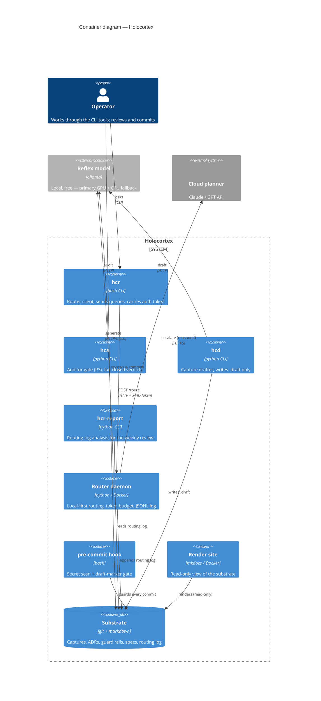
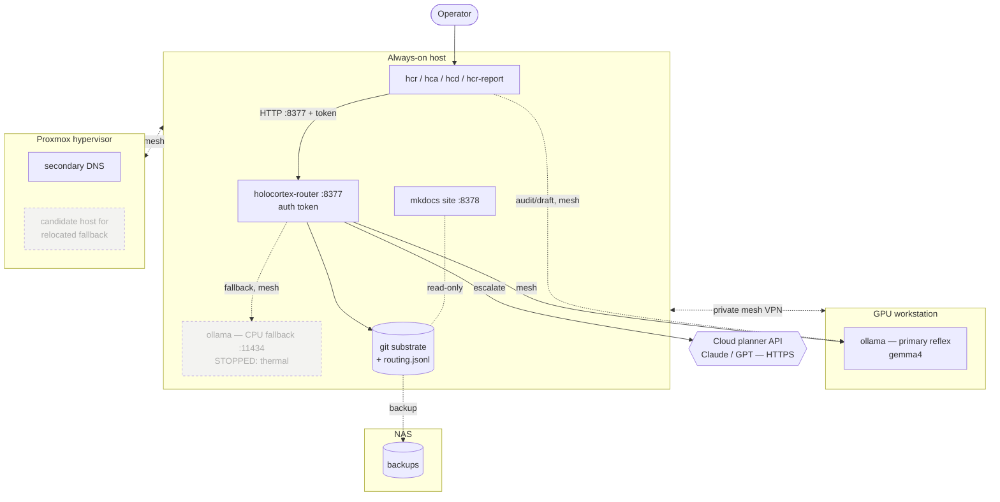

# Architecture

Two views of the same system. The **C4 Container diagram** shows the runnable
pieces and how they communicate (the logical software architecture). The
**Deployment diagram** shows which physical host each piece runs on (the
operational topology). Read them together: C4 answers "what talks to what,"
deployment answers "what runs where."

Both render on GitHub and in the mkdocs site. Host labels are role-based by
design — the same architecture applies to any hostnames.

## C4 Container diagram — logical view

If the C4 renderer is unavailable, the same relationships hold in the
deployment view below.

## Deployment diagram — physical view

## Notes

- **Trust boundary** is the private mesh: the router port is reachable across
  it, optionally gated by an auth token. Nodes reach inference by mesh name,
  so the GPU host sleeping degrades to the fallback rather than failing.
- **The CPU fallback is drawn dashed** because it is currently stopped after a
  thermal event on the always-on host; relocating it to the hypervisor (which
  has better cooling and isolates the risk from primary DNS) is an open
  decision. See BACKLOG and the relevant ADR.
- **The substrate is the hub of the logical view for a reason:** every tool
  reads from or writes to git + markdown. That is the design — the repo is the
  system, and services are replaceable views and actors over it.
