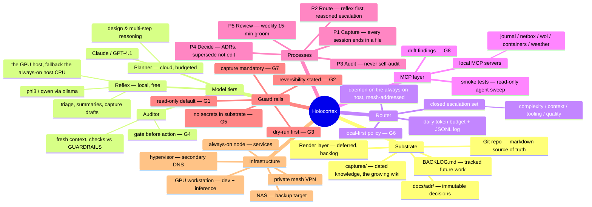

# Holocortex — System Mind Map

Renders in any Mermaid-aware viewer (GitHub, Obsidian, VS Code).

## Reading the map

Left half is knowledge flow (substrate ← processes), right half is execution
(tiers ← router ← infra). Guard rails cut across everything. If a node here has
no corresponding file or backlog item, that's drift — G8 applies to the map too.
